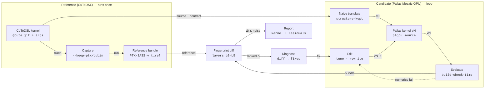

# Mosaicist

**CuTeDSL → PTX → Pallas Mosaic GPU**

Design doc · Draft 0.1 · 2026-09-10 · targets sm_90a / sm_100a
Published version: <https://claude.ai/code/artifact/b9868f0e-b8ba-43d2-bfc8-28367d0d3b56>

> **Implementation status (2026-09-12):** M0–M4 are implemented and exercised on hardware. M0: capture workers (`mosaicist capture`) validated on both compilers, plus the numerics gate, input suites, timing statistics, acceptance rule and beam. M1: fingerprints L0–L5, the diff and Diagnose, checked against real CuTeDSL and Mosaic PTX. M2: contract extraction, the machine-readable catalog, and a template translator covering the GEMM family for wgmma and tcgen05 — the LLM backend is a seam (`Translator`), not a dependency. M3: the knob space, the tuner that routes diff rows to knobs through the catalog, and the loop driver (`mosaicist converge`), run end to end against FlashInfer's CuTeDSL GEMM on a B200. M4: the structural rewriter with a deterministic variant backend and an `LLMRewriter` seam whose model call is injected. M5 is partly done in practice — the Blackwell port in `experiments/flashinfer-megamoe-sm100a` uses tcgen05, TMEM and 2-CTA MMA, and L5 reads SASS from a capture — but `ncu` profiling is not wired up. See README.md.

A tool that lowers a CuTeDSL kernel to PTX, translates it naively into Pallas Mosaic GPU, checks that the two match numerically, and then keeps editing the Pallas kernel, steered by PTX and SASS diffs, until its runtime and accuracy match the original.

**Color legend (published version):** ochre = Reference (CuTeDSL kernel and its PTX); blue = Candidate (Pallas Mosaic GPU kernel and its PTX).

## Contents

1. [The short answer](#1-the-short-answer)
2. [Scope](#2-scope)
3. [Pipeline](#3-pipeline)
4. [Capturing reference PTX](#4-capturing-reference-ptx)
5. [Naive translation](#5-naive-translation)
6. [Numerical equivalence](#6-numerical-equivalence)
7. [Fingerprints & PTX diff](#7-fingerprints--ptx-diff)
8. [The convergence loop](#8-the-convergence-loop)
9. [Measuring runtime fairly](#9-measuring-runtime-fairly)
10. [Worked example: Hopper BF16 GEMM](#10-worked-example-hopper-bf16-gemm)
11. [Package & CLI](#11-package--cli)
12. [Risks & open questions](#12-risks--open-questions)
13. [Milestones](#13-milestones)

---

## §1 The short answer

You can't make PTX similarity the goal. Runtime is the goal, numerics decide pass/fail, and the PTX diff tells you what to change next. Here's how the loop gets there:

1. **Runtime is the objective; numerics are a gate.**
   A candidate is kept only if it passes the numerics suite and runs faster (or matches the reference more closely at the same speed). If you optimize PTX similarity directly, you get kernels that look like the reference without running like it.

2. **Diff fingerprints, not text.**
   Both PTX files get lifted into a six-layer fingerprint: launch geometry, instruction mix, loop and pipeline structure, instruction order, floating-point flavor, and SASS/profiler data. The tool diffs them layer by layer, coarse to fine. PTX is virtual ISA and ptxas reshapes it, so SASS and `ncu` have the final word.

3. **Converge in dependency order.**
   Skeleton → data movement → tensor cores → concurrency → micro-scheduling. Fine-level diffs are noise until the coarse ones match: comparing `wgmma` ordering means nothing if the tile shape is still different.

4. **One discrepancy per edit; knobs before rewrites.**
   Each diff row maps to a fix from a catalog. Parameter fixes (stages, swizzle, cluster shape) are cheap and deterministic. Structural fixes (warp specialization, persistent scheduling) go to an LLM rewriter, one change at a time, so every speedup can be traced to a specific edit.

5. **Numerics converge as the structure does.**
   Once MMA shape, K traversal order, accumulator type, and epilogue op order match, fp32-accumulated outputs usually become bit-identical. So the fraction of bitwise-equal outputs is a second convergence signal. The floating-point-flavor layer catches `ex2.approx`, `.ftz`, and contraction differences that tolerance checks can hide.

6. **Stop at the noise floor or at a named gap.**
   The loop stops when the runtime gap is inside the reference's own run-to-run noise, or when every remaining diff is labeled as something Pallas can't express. Those gaps become a report with minimal repros you can file upstream.

---

## §2 Scope

### Goals

- Input: a CuTeDSL `@cute.jit` entry point plus a factory that builds example arguments.
- Output: a Pallas Mosaic GPU kernel that passes the equivalence suite, runs within the noise band of the reference (default target ≤ 1.03× device time), and ships with a report of any differences left.
- Kernel families first: dense and FP8 GEMM, grouped GEMM, then attention. Elementwise and reductions serve as smoke tests.

### Non-goals

- Pre-Hopper targets. Mosaic GPU needs sm_90+, and older kernels belong on Pallas's Triton backend.
- Byte-identical PTX. The two compilers emit different glue code, and ptxas erases much of it anyway.
- A general CuTe-IR → Pallas compiler. Mosaicist translates semantics and structure, not layout algebra.
- Multi-GPU and collective kernels in v1.

---

## §3 Pipeline

The reference path runs once and is cached. The candidate path is a loop. Its only way out is a runtime gap inside the noise floor, or a residual report when the edit budget runs out.



*One capture, many candidates. The dashed edge is the numerics gate: a failing candidate goes straight to repair and never gets diffed or timed. Only a fingerprint diff whose runtime gap is inside the noise floor reaches the report.*

---

## §4 Capturing reference PTX

CuTeDSL traces Python into MLIR (the `cute` and `cute_nvgpu` dialects), lowers it through NVVM to PTX, and assembles a cubin. Capture keeps every intermediate and records the facts PTX can't hold on its own.

```bash
# in a sandboxed worker process
CUTE_DSL_KEEP_PTX=1 CUTE_DSL_KEEP_CUBIN=1 CUTE_DSL_DUMP_DIR=runs/ref/ \
  python -m mosaicist.worker.ref kernels/hopper_gemm.py:run --args args.py
```

```python
# inside the worker, equivalently:
compiled = cute.compile(entry, *args,
    options="--keep-ptx --keep-cubin --keep-sass --generate-line-info")
```

- **Launch geometry.** Grid dimensions aren't in PTX. The worker patches the kernel's `.launch(grid, block, cluster, smem)` during tracing to record them. It cross-checks against the PTX directives `.reqntid`/`.maxntid` and `.reqnctapercluster`.
- **Resources.** Register count, spill bytes, and static shared memory come from `ptxas -v` and `cuobjdump --dump-resource-usage` on the cubin. Dynamic shared memory comes from the launch record.
- **Behavior.** The worker runs the compiled kernel on every input in the numerics suite (§6) and stores the outputs. Device time is measured the same way the candidate's will be (§9).
- **Line info.** `--generate-line-info` emits `.loc` directives, so every PTX instruction maps back to a line of CuTeDSL source. The rewriter needs this mapping (§8).
- **MLIR.** The traced module is kept too. It's the most reliable place to read tile shapes, MMA atoms, and pipeline stage counts without parsing Python.

On the Pallas side the same bundle comes from Mosaic GPU's dump flags: `MOSAIC_GPU_DUMP_PTX`, `MOSAIC_GPU_DUMP_PTXAS`, `MOSAIC_GPU_DUMP_SASS`, `MOSAIC_GPU_DUMP_RESOURCES`, and `MOSAIC_GPU_DUMP_TO=<dir>`. Both paths write into one `Bundle` schema, so the rest of the system never needs to know which compiler produced an artifact.

> **Pin the assembler.** CuTeDSL may use its bundled ptxas while Mosaic GPU uses whichever one it finds. Before any SASS comparison, Mosaicist re-assembles *both* PTX files with one pinned `ptxas` for the same `.target` (e.g. `sm_90a`). It flags any mismatch in PTX ISA version so nobody spends a day chasing a toolchain difference.

---

## §5 Naive translation

The first Pallas kernel, v0, has one job: be obviously correct. The translation keeps the **structure** (the same output tile shape, the same tile-to-block mapping, the same K traversal order) and ignores **performance** (no warp specialization, no clusters, default pipelining). Keeping the tile grid means the coarse fingerprint layers already line up at v0. It also means the K loop splits the same way, so the numerics are close from the start.

### Two steps

1. **Extract the contract (deterministic).** From capture: argument shapes, dtypes and strides, output aliasing, tile shape, MMA atom, copy atoms, stage count, and launch geometry. From the user, optionally: an fp64 reference function. If the user doesn't provide one, the tool drafts one and trusts it only after checking it against CuTeDSL outputs.
2. **Emit v0 (LLM, constrained).** A translator agent writes Pallas using the construct catalog below. It's limited to a "naive subset": `pl.pallas_call` or `plgpu.kernel` with one compute warpgroup, `plgpu.emit_pipeline` with default settings, and `plgpu.wgmma`/`tcgen05_mma` with a full wait each step. If v0 fails the numerics gate, the agent gets a structured error map back. For example, "only the last row of tiles is wrong" points to boundary masking, and "error ∝ K" points to accumulator dtype.

### Construct catalog

The catalog is shared by the translator and the rewriter. Each row also carries the fingerprint signature it produces, which is how a PTX diff row turns into a source edit.

| Concept | CuTeDSL | Pallas Mosaic GPU |
|---|---|---|
| **Launch** | `@cute.kernel` + `.launch(grid, block, cluster, smem)` | `plgpu.kernel(body, out_shape, grid=, grid_names=, cluster=, num_threads=, thread_name=, scratch_shapes=)` |
| **Tiling gmem** | `cute.local_tile`, `zipped_divide` | `plgpu.BlockSpec` index maps; `ref.at[pl.ds(i*t, t)]` |
| **Smem layout** | composed layouts with `Swizzle` | `transforms=(plgpu.TilingTransform(...), plgpu.SwizzleTransform(128))` |
| **TMA load** | `cpasync.CopyBulkTensorTileG2SOp` + mbarrier | `plgpu.copy_gmem_to_smem(src, dst, barrier)` + `plgpu.barrier_wait` |
| **Multicast** | multicast TMA atom over a cluster | `cluster=` + `collective_axes=` on the copy |
| **Pipeline** | `cutlass.pipeline.PipelineTmaAsync`, *stages* | `emit_pipeline(max_concurrent_steps=, delay_release=)` or a manual `plgpu.Barrier` ring |
| **Hopper MMA** | `warpgroup.MmaF16BF16Op` + `cute.gemm` | `plgpu.wgmma(acc, a, b)`, `plgpu.wgmma_wait(n)`, `plgpu.ACC` |
| **Blackwell MMA** | `tcgen05` atoms, TMEM allocators | `plgpu.tcgen05_mma(..., collective_axis=)`, `plgpu.TMEM`, `async_load_tmem`, `tcgen05_commit_arrive` |
| **Warp roles** | branching on warp / warpgroup index | `num_threads` + `lax.axis_index` + `pl.when`; `emit_pipeline_warp_specialized` |
| **Registers** | `setmaxnreg` helpers in `cute.arch` | `plgpu.set_max_registers`; `memory_registers=` |
| **TMA store** | `CopyBulkTensorTileS2GOp` + proxy fence | `plgpu.commit_smem()`, `copy_smem_to_gmem`, `wait_smem_to_gmem(n)` |
| **Scheduling** | persistent tile schedulers; cluster launch control | `plgpu.nd_loop`; `dynamic_scheduling_loop`, `try_cluster_cancel` (sm_100a) |
| **Rasterization** | swizzled tile-index mapping | `plgpu.planar_snake` |
| **Fragments** | `cute.make_fragment`, register layouts | arrays in `plgpu.Layout.WGMMA`; `plgpu.layout_cast` |

Some constructs have no clean analogue. Arbitrary CuTe layout algebra on register fragments, roles below warpgroup granularity, and inline PTX are tagged `low-level`: the rewriter may drop to the underlying `jax.experimental.mosaic_gpu` API for them. If that isn't possible either, they're tagged `gap` and go straight into the report.

---

## §6 Numerical equivalence

"Matches the reference to 1e-3" is too weak and too strict at once. It's too weak because it can hide an approximate `exp`. It's too strict because a different but equally good accumulation order can fail it. Mosaicist checks three things, each against a stronger oracle than the last.

| Check | Compares | Passes when | Role |
|---|---|---|---|
| **Oracle-relative** | both kernels vs an fp64 oracle | the candidate's error distribution is no worse than the reference's (below) | **Gate** |
| **Safety** | guard bands, NaN/Inf masks, repeat runs | sentinels intact; special-value masks identical; deterministic unless the reference isn't | **Gate** |
| **Bitwise** | candidate vs reference | — | Convergence signal: % of outputs bit-identical, plus a ULP histogram |

With `e = |y − y₆₄|` measured in ULPs of the output dtype, a candidate passes when, for each quantile *q*:

```text
Q_q(e_cand) ≤ (1 + δ) · Q_q(e_ref) + τ      q ∈ {0.5, 0.99, 1.0},  δ = 0.10,  τ = 1 ulp
```

This ties accuracy to what the reference actually achieves, not to an arbitrary tolerance. The candidate may beat the reference; it may not be meaningfully worse.

### Input suite

- **Shapes:** tile-aligned, ragged in each of M/N/K (to exercise predication and TMA out-of-bounds fill), minimal, and production-sized.
- **Distributions:** N(0,1); uniform; wide dynamic range (magnitudes spread across 2<sup>±k</sup>); cancellation-heavy (sums of near-opposites); for FP8, values that straddle the scale boundaries.
- **Special values:** NaN, ±Inf, −0.0, and subnormals, placed in sparse positions so a propagation bug shows up as a pattern.
- **Seeds:** five per case. The suite is generated once and stored with the reference bundle.

Outputs are allocated inside guard bands filled with a sentinel bit pattern, which catches out-of-bounds writes that happen to leave in-bounds values correct. `compute-sanitizer` (memcheck, racecheck, synccheck) runs on v0 and on the final kernel. It's too slow to run on every candidate.

> **Why bitwise equality shows up.** Tensor-core MMA is deterministic for a given instruction shape and operand order. When the candidate issues the same `wgmma.m64nNk16` sequence over K in the same order, accumulates in fp32, and applies the epilogue in the same order (for example, one `fma.rn` vs a separate `mul` then `add`), it produces the same bits. A rising bitwise-equal fraction is strong evidence the structures have actually converged.

---

## §7 Fingerprints & PTX diff

A textual PTX diff is useless: virtual registers get renumbered, address arithmetic moves, and the two compilers emit different prologues. Instead, each bundle is parsed (entries, directives, basic blocks, CFG, natural loops), normalized (canonical register names, `.loc` stripped into a side table, constants folded), and lifted into a layered **fingerprint**. Instruction counts are always taken *per loop body, per warp role*, because whole-kernel counts mostly measure unrolling.

| Layer | Extracted | Source |
|---|---|---|
| **L0 Skeleton** | grid, block, cluster, warpgroups per CTA and their roles, dynamic smem, regs/thread, occupancy | launch record, PTX directives, ptxas |
| **L1 Inventory** | `wgmma`/`tcgen05.mma` shape, dtypes, and flags; TMA dimensionality, multicast, cache hints; mbarrier ops; `ldmatrix`/`stmatrix`; `ld/st.global` vector widths | PTX |
| **L2 Structure** | loop nest; pipeline depth (mbarrier ring size, `wait_group N`); warp-role branches; persistent tile loop; epilogue form | PTX CFG + dataflow |
| **L3 Order** | sequence alignment (Needleman–Wunsch over normalized opcodes) of the critical ops in each steady-state loop body | PTX |
| **L4 FP flavor** | rounding and approximation: `fma` contraction, `ex2.approx(.ftz)`, `rcp.approx` vs `div.rn`, `cvt.rn/.rz/.satfinite`, accumulator promotion points | PTX |
| **L5 Machine** | SASS hot-loop length, `STL/LDL` spills, stall-reason mix, tensor-pipe utilization, DRAM/L2 throughput, smem bank conflicts | pinned ptxas + `nvdisasm`, `ncu` |

Each layer produces a distance *d<sub>l</sub>* and a list of discrepancy rows. The weighted sum *Σ w<sub>l</sub>·d<sub>l</sub>* is only a tiebreaker (§8). What matters is the rows, because each one points to an edit.

### What a diff looks like

This illustrative excerpt shows the steady-state consumer loop of a Hopper BF16 GEMM with a 128×256 tile. On the left is the reference; on the right is a naive v0 that kept the tile shape but not the warpgroup structure. Marked lines are the ones the aligner couldn't match.

**Reference · consumer WG ×2** (ptx · sm_90a)

```text
   // role: consumer (warpgroup 1, 2)
≠  setmaxnreg.inc.sync.aligned.u32 240;
   LOOP_K:
   mbarrier.try_wait.parity.shared::cta.b64 %p9, [%r41], %r42;
   wgmma.fence.sync.aligned;
≠  wgmma.mma_async.sync.aligned.m64n256k16.f32.bf16.bf16 … ×4
   wgmma.commit_group.sync.aligned;
≠  wgmma.wait_group.sync.aligned 1;
≠  mbarrier.arrive.shared::cta.b64 _, [%r57];  // stage s−1
   @%p12 bra LOOP_K;
   // role: producer (warpgroup 0)
≠  cp.async.bulk.tensor.2d….multicast::cluster [%r60], …;
```

**Candidate v0 · single WG** (ptx · sm_90a)

```text
   // role: (none — one warpgroup does everything)
−  // no setmaxnreg
   LOOP_K:
   mbarrier.try_wait.parity.shared::cta.b64 %p3, [%r22], %r23;
   wgmma.fence.sync.aligned;
≠  wgmma.mma_async.sync.aligned.m64n256k16.f32.bf16.bf16 … ×8
   wgmma.commit_group.sync.aligned;
≠  wgmma.wait_group.sync.aligned 0;
≠  mbarrier.arrive.shared::cta.b64 _, [%r30];  // stage s
   @%p5 bra LOOP_K;
   // TMA issued inline by the same warpgroup
≠  cp.async.bulk.tensor.2d.shared::cluster.global… [%r33], …;
```

Same MMA instruction, very different kernel. Diagnose turns the unmatched rows into fixes ranked by convergence phase (§8), each tagged by how it gets applied (`knob` `rewrite` `low-level` `gap`):

| # | Phase | Layer | Fix | Tag |
|---|---|---|---|---|
| 1 | P1 | L0·L5 | **One compute warpgroup, not two.** A 128×256 fp32 accumulator on 128 threads needs 256 registers per thread, which is over the 255-register limit, and SASS shows `STL/LDL` spills in the loop. Split M across two compute warpgroups: `emit_pipeline_warp_specialized(num_compute_wgs=2, wg_axis="wg")`. | `rewrite` |
| 2 | P2 | L0·L1 | **No TMA multicast.** The reference runs a 2×1 cluster and multicasts the shared operand. Launch with `cluster=(2,)` and pass `collective_axes=` on that operand's copy; if the pipeline helper can't express it, fall back to a manual barrier ring. | `rewrite` |
| 3 | P3 | L2 | **MMA drained every step.** `wait_group 0` serializes the tensor core against the next stage's wait. Use `plgpu.wgmma_wait(1)` with `delay_release=1`, so stage s−1's buffer is released instead of stage s's. | `knob` |
| 4 | P4 | L0·L2 | **No producer role or register rebalancing.** The reference moves registers from producer to consumers (`setmaxnreg` 40 / 240). Set `memory_registers=40`; the consumer increase follows. | `knob` |

`mosaicist diff tests/fixtures/hopper_gemm_ref.ptx tests/fixtures/hopper_gemm_v0.ptx` reproduces this ranking on abbreviated fixtures of the two kernels. It also reports the smaller rows: pipeline depth (P2), `stmatrix` use and register count (P5), and the per-loop order alignments.

---

## §8 The convergence loop

Diffs are addressed in phases. Each phase matches one group of fingerprint rows and unlocks the next, and the order follows what bounds performance. First get the kernel limited by the right resource, then hide latency, then polish.

| Phase | Rows to match | Main Pallas levers |
|---|---|---|
| **P1 Skeleton** | L0: tile shape, warpgroups and roles, grid mapping and raster order, smem budget, spills | `grid`, block shapes, `num_threads`, `planar_snake` |
| **P2 Data movement** | L1/L2: TMA vs LSU loads, swizzle and tiling, pipeline depth, multicast | `SwizzleTransform`, `TilingTransform`, `max_concurrent_steps`, `cluster`, `collective_axes` |
| **P3 Tensor core** | L1/L3: MMA shape and operand sources, accumulator location, in-flight MMA depth | `wgmma_wait(n)`, `delay_release`; `tcgen05_mma`, `TMEM`, `collective_axis` |
| **P4 Concurrency** | L2: producer/consumer split, register rebalancing, persistent loop, epilogue/mainloop overlap | `emit_pipeline_warp_specialized`, `set_max_registers`, `nd_loop`, `dynamic_scheduling_loop`, `wait_smem_to_gmem` |
| **P5 Micro** | L3/L4/L5: epilogue vector widths, predication, fence placement, FP flavor, stall reasons | epilogue rewrite, dtype casts, math-function choice, and low-level Mosaic GPU where needed |

### Two ways to edit

- **Knob tuner (deterministic, cheap).** When a diff row names a value, like "the reference uses 4 stages", the tuner sets it directly and then searches a small neighborhood around it. The reference is a strong prior, not necessarily the optimum. Candidates compile and time in seconds, so a few hundred of them fit in a budget.
- **Structural rewriter (LLM agent).** For each rewrite the agent gets: the highest-ranked open row; the reference PTX around the discrepancy, mapped through `.loc` to the CuTeDSL source lines that produced it; the matching candidate PTX mapped to Pallas lines (or aligned by anchor instructions, i.e. unique MMA or TMA sites, when Mosaic GPU's locations don't survive); the catalog entry; and the current source. It returns *one* small patch aimed at that row.

### Acceptance rule

```text
accept(c) ⇔ numerics_pass(c)
          ∧ ( t(c) < t(best) − noise
              ∨ ( |t(c) − t(best)| ≤ noise  ∧  D(c) < D(best) ) )
```

The tool keeps a beam of the four best candidates so a structural change that briefly gets slower isn't lost. Sometimes a candidate lowers the fingerprint distance *D* but gets slower. It's rejected, but logged: it usually means a hidden dependency. For example, matching pipeline depth before swizzle can multiply bank conflicts. When that happens Diagnose reorders its queue.

### Stopping

- **Converged:** the candidate's device time is within the noise floor of the reference (or better), the numerics gate passes, and the sanitizer is clean.
- **Residual:** the budget is exhausted, or every open row is tagged `gap` or is a *compiler residual* (glue code, layout conversions, or fences Mosaic GPU inserts that no source change removes). Each gap comes with a minimal repro.
- **Surpassed:** the candidate beats the reference beyond noise. The reference was a guide, not a ceiling.

---

## §9 Measuring runtime fairly

JAX dispatch and CuTeDSL launch have very different host overheads, so wall-clock timing compares the Python stacks, not the kernels. Mosaicist times only on the device, under the same conditions for both kernels.

- **Device time only:** kernel durations from CUPTI activity records, taken from the same trace for both kernels. Wrapping the call in a CUDA graph is an allowed fallback.
- **Controlled conditions:** locked clocks (`nvidia-smi -lgc`); L2 flushed between repetitions by writing a buffer twice the size of L2; warmup; ≥ 50 timed reps; median with a bootstrap confidence interval.
- **Noise floor:** an A/A run of the reference against itself sets how small a difference counts as real. Both the acceptance rule and the stopping rule read this number, never a hard-coded percentage.
- **Profiler on demand:** `ncu` takes tens of seconds per kernel, so it runs only on beam members and on the reference, never on every candidate.
- **Isolation:** each candidate builds and runs in a fresh subprocess, because one illegal-address fault poisons the CUDA context. JAX runs with `XLA_PYTHON_CLIENT_PREALLOCATE=false`. Artifacts are cached by the source's content hash.

---

## §10 Worked example: Hopper BF16 GEMM

Take the warp-specialized Hopper dense GEMM from the CuTeDSL examples at 8192³. The expected trajectory below is a plan, not a measurement. The point is which fingerprint rows each step should close.

| Step | Change | Rows closed | Expected effect |
|---|---|---|---|
| **v0** | naive: 128×256 tile, 1 warpgroup, 2 stages, full MMA drain | — | correct; spills; far off |
| **v1** | 2 compute warpgroups + 1 memory warpgroup | L0 roles, L5 spills | largest single step |
| **v2** | 4 stages, 128B swizzle | L2 depth, L1 descriptors | memory latency hidden |
| **v3** | `wgmma_wait(1)` + `delay_release=1` | L2/L3 wait depth | tensor-core pipe stays busy |
| **v4** | register rebalancing 40 / 240 | L0 setmaxnreg | headroom for epilogue |
| **v5** | 2×1 cluster, multicast of the shared operand | L0 cluster, L1 multicast | lower L2→SM traffic |
| **v6** | persistent loop, snake raster, TMA-store epilogue overlap | L2 tile loop, epilogue | tail and epilogue hidden |

By v3 the MMA sequence and K order match. That's the point where the bitwise-equal fraction should jump, and if it doesn't, the L4 layer shows why (usually epilogue contraction or a conversion rounding mode).

---

## §11 Package & CLI

```text
mosaicist/
  capture/     # cutedsl.py · pallas.py · launch_hook.py · Bundle schema
  contract.py  # shapes, dtypes, strides, tiles, atoms, stages, oracle
  translate/   # catalog.yaml · naive subset templates · translator agent · repair
  verify/      # suites.py · oracle.py · compare.py (ULP, quantiles) · guards.py · sanitizer.py
  ptx/         # parse.py · normalize.py · cfg.py · roles.py · features.py · align.py
  sass/        # pinned ptxas · nvdisasm · resource usage
  bench/       # cupti timer · l2 flush · noise floor · ncu
  converge/    # diagnose.py · rules/ · tuner.py · rewriter.py · beam.py · loop.py
  report/      # residuals, gap repros, trajectory
  worker/      # sandboxed ref / candidate processes
```

```bash
mosaicist capture   kernels/hopper_gemm.py:run --args args.py --arch sm_90a
mosaicist translate runs/hopper_gemm            # → cand/v0.py, verified
mosaicist diff      runs/hopper_gemm cand/v0.py # fingerprint report, no edits
mosaicist converge  runs/hopper_gemm --budget 200 --target noise
mosaicist report    runs/hopper_gemm
```

`diff` is useful on its own: point it at a hand-written Pallas kernel and it tells you what's structurally different from the CuTeDSL original.

---

## §12 Risks & open questions

- **Expressiveness ceiling.** Some CUTLASS patterns may never have a Pallas spelling. The low-level escape hatch helps, but each use of it makes the result less Pallas-like. Open question: should low-level Mosaic GPU count as "converged"?
- **Compiler residue.** Mosaic GPU may insert layout conversions or fences no source change can remove. The report has to tell "you can fix this" apart from "file this upstream".
- **PTX plateaus.** Two kernels can match through L4 and still differ in SASS scheduling. L5 is the tiebreaker, but its diffs rarely point to a source change.
- **LLM patch safety.** Rewrites can be subtly racy. The numerics gate, the guard bands, and a sanitizer run on each beam member are the defenses. Patch size is capped so problems can be traced.
- **"Known-optimal" is an assumption.** The reference is a strong prior, not proof. The tuner searches past it, and the report says so when the candidate wins.
- **Moving APIs.** Pallas Mosaic GPU and CuTeDSL both change quickly. The catalog is versioned against pinned JAX and CUTLASS releases, and each bundle records versions.

---

## §13 Milestones

| | Milestone | Scope |
|---|---|---|
| **M0** | *Harness.* | Capture, benchmark, and numerics for a hand-written CuTeDSL/Pallas pair. No translation yet. The goal is trusted measurements and a known noise floor. |
| **M1** | *Fingerprints.* | PTX parser plus layers L0–L2 and `mosaicist diff` on the Hopper GEMM pair. Check that the rows it flags are the differences an expert would name. |
| **M2** | *Naive translation.* | Contract extraction, the catalog, the translator agent, and the repair loop for the GEMM family. |
| **M3** | *Knob convergence.* | Diagnosis rules and the tuner. Converge the Hopper GEMM using knobs alone to see how far parameters get. |
| **M4** | *Structural rewrites.* | The LLM rewriter, layers L3/L4, and the beam. Targets: FP8 GEMM with promoted accumulation, then FMHA. |
| **M5** | *Blackwell.* | tcgen05, TMEM, 2-CTA MMA, cluster-launch-control scheduling, and the full L5 SASS and profiler layer. |

---

## Sources

API names checked against current documentation:

- [Pallas Mosaic GPU](https://docs.jax.dev/en/latest/pallas/gpu/index.html) · [Writing Mosaic GPU kernels with Pallas](https://docs.jax.dev/en/latest/pallas/gpu/reference.html) · [Mosaic GPU pipelining](https://docs.jax.dev/en/latest/pallas/gpu/pipelining.html) · [plgpu module reference](https://docs.jax.dev/en/latest/jax.experimental.pallas.mosaic_gpu.html)
- [CuTe DSL JIT compilation options](https://docs.nvidia.com/cutlass/latest/media/docs/pythonDSL/cute_dsl_general/dsl_jit_compilation_options.html) · [CuTe DSL debugging](https://docs.nvidia.com/cutlass/latest/media/docs/pythonDSL/cute_dsl_general/debugging.html) · [CUTLASS #2981 (bundled ptxas version)](https://github.com/NVIDIA/cutlass/issues/2981)
