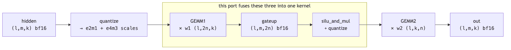
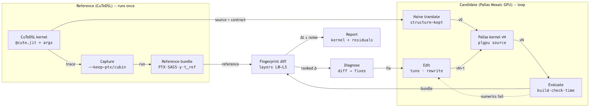

# Porting FlashInfer's MegaMoE CuTeDSL kernel to Pallas Mosaic GPU

### Why performance parity is not currently achievable, and what would change that

**Hardware:** NVIDIA B200 (sm_100a) · **Software:** JAX/jaxlib 0.11.1, flashinfer-python
0.6.18.post1, nvidia-cutlass-dsl 4.7.1, CUDA 12.8, driver 570.148.08

---

## 1. Summary

The masked mixture-of-experts (MoE) path from FlashInfer's `flashinfer_cutedsl_moe.py`
was reimplemented in **Pallas Mosaic GPU**, JAX's kernel-authoring layer for NVIDIA GPUs,
keeping the NVFP4 numeric format end to end. The port is numerically faithful: its grouped
matrix multiply is **bit-exact** against a float64 oracle, and the full path agrees with
the reference to bfloat16 precision (rms 1.4–2.1 × 10⁻³).

On speed it reaches **60.8 µs against the reference's 46.0 µs — 76% of the reference** —
having started at 120.4 µs. Every remaining difference is structural rather than a tuning
parameter, and the decisive one cannot be expressed in Pallas today:

> **A warp-specialized Blackwell matrix-multiply kernel launches 192 threads: four warps
> running the epilogue, one issuing memory transfers, one issuing tensor-core
> instructions. In Pallas, the `num_threads` parameter counts *warpgroups* (128 threads
> each), so the only reachable block sizes are 128, 256, 384. 192 is not among them, and
> both neighbours give up something the reference keeps.**

This is not inferred from reading the reference's source. Its configuration was
reconstructed from its captured launch record and **executed**: adopting it makes the
Pallas kernel *slower*, because it only pays off with the thread layout that cannot be
built.

Two limitations have been reported upstream to the JAX project with self-contained
reproductions. Neither is a defect; both are missing capabilities in a young API.

---

## 2. Background

### 2.1 What the kernel does

A mixture-of-experts layer routes each token to a small number of expert feed-forward
networks. The "masked" formulation used here gives every expert a fixed row capacity `m`
and a count `masked_m[l]` of how many of those rows are real, so the whole layer is a
batch of `l` independent matrix multiplies with a per-expert row count. At the benchmark
size — `l=8` experts, `m=512` rows each, hidden size `k=2048`, intermediate size `n=1024`
— one layer is four GPU kernels:



*The four stages. This port fuses the middle three into a single kernel, which removes a
16.8 MB intermediate tensor; the reference keeps them separate.*

### 2.2 NVFP4, and why it complicates everything

The operands are **NVFP4**: each value is stored in 4 bits (`e2m1` — one sign bit, two
exponent, one mantissa, representing only {0, ±0.5, ±1, ±1.5, ±2, ±3, ±4, ±6}), and every
group of 16 consecutive values along the contracted dimension shares an 8-bit scale
(`e4m3`), with a further per-expert global scale. Blackwell's tensor cores consume this
format natively through `tcgen05.mma.kind.block_scale`, which applies the block scales
inside the matrix-multiply instruction.

Two consequences run through the whole report:

1. **Producing the scales is half the work.** Quantizing a tile means reducing over each
   16-element group to find its maximum, then broadcasting the resulting scale back across
   that group. This is where the second reported limitation bites (§7.2).
2. **Bit-exactness is achievable for the multiply.** Because `e2m1` values and `e4m3`
   scales are all small integers times powers of two, their products and sums are exactly
   representable in a float32 accumulator. The port's GEMM matches a float64 oracle
   exactly, which makes performance comparisons unambiguous — the two kernels are computing
   precisely the same thing.

### 2.3 The two programming models

**CuTeDSL** (the reference) is NVIDIA's Python DSL inside CUTLASS. It exposes CUDA's
execution hierarchy directly: the author chooses how many warps to launch and assigns each
a role.

**Pallas Mosaic GPU** (the port) is JAX's kernel layer. It is higher-level: shared-memory
layouts, register layouts and synchronisation are largely inferred, and the block is sized
in *warpgroups* rather than warps. That abstraction is what makes it pleasant to write and
is also, precisely, the source of the limitation in §7.1.

---

## 3. How the measurements were produced

Work was driven by **Mosaicist**, a convergence engine built alongside the port and
described in full in Appendix A. For reading the results, three properties matter:

- **Runtime is the objective; numerics are a gate.** A candidate is kept only if it passes
  the numerics gate *and* beats the incumbent by more than the reference's own run-to-run
  noise. A fingerprint distance between the two kernels' machine code is used only to break
  ties.
- **Timing is device time from CUPTI activity records, not wall clock.** Every kernel here
  finishes well inside the ~1.5 ms host round trip; a naive wall-clock loop reports that
  floor for all of them, and even ranks a fused path as faster than one of its own
  constituent GEMMs.
- **The noise floor is measured, not assumed.** The reference's run-to-run spread is 1.0%;
  this port's is nearer 2%. Several changes that looked like improvements did not survive
  repetition and are reported below as null results.

---

## 4. Results

### 4.1 Correctness

| suite | result |
|---|---|
| NVFP4 arithmetic and the MMA scale tiling (runs on any backend) | 5/5 |
| Kernel numerics on B200 | 6/6 — 4 GEMM bit-exact, 2 end-to-end at rms 1.4–2.1e-3 |
| Stress: block_k 128–512, 1–6 stages, tile widths 128/256, 1-CTA and 2-CTA, 32 K-blocks, 4 seeds | 12/12 bit-exact |
| Engine unit tests | 84 |

End-to-end agreement cannot be bit-exact and this is a property of the algorithm, not a
defect: an intermediate re-quantization turns a 1-ulp difference in the first GEMM's
bfloat16 output into a whole `e2m1` step, and `e2m1` has three mantissa bits.

### 4.2 Performance

| stage | FlashInfer CuTeDSL | this port | gap |
|---|---:|---:|---:|
| quantize hidden (+ scale retile) | 10.9 µs | 13.0 µs | 1.19× |
| GEMM1 + silu_and_mul + quantize | 13.4 + 8.7 = 22.1 µs | 31.6 µs (one fused kernel) | 1.43× |
| GEMM2 | 9.4 µs · 1821 TFLOP/s | 13.0 µs · 1322 TFLOP/s | 1.38× |
| **end to end** | **46.0 µs** | **60.8 µs** | **1.32×** |
| dense bfloat16 `jnp.einsum` baseline | 65.4 µs | | |

The bfloat16 baseline is what the same computation would cost without any of this work.
The port is 1.08× faster than it; the reference is 1.42× faster than it.

### 4.3 What produced the improvement from 120.4 µs

| change | effect |
|---|---|
| `exp2` instead of `jax.nn.sigmoid` | 42.1 → 27.1 µs on the activation kernel |
| `approx_math=True` | 26.5 → 16.9 µs on the same kernel |
| narrower sub-tiles for the scale expansion | 14.2 → 10.3 µs on plain quantize |
| shape-adaptive pipeline depth and K step | GEMM1 27.2 → 18.3, GEMM2 18.5 → 12.9 |
| warp split inside one warpgroup | GEMM1 1855 → 1910 TFLOP/s |
| **fusing GEMM1 + silu_and_mul + quantize** | **end to end 83.5 → 65.3 µs** |
| select instead of multiply-add in the expansion | fused kernel 34.1 → 32.5 µs |
| assembling values by concatenation | fused kernel 32.0 → 31.2 µs |

Two of these are worth dwelling on.

**`jax.nn.sigmoid` does not reach the hardware exponential.** Rewriting the activation as
`g / (1 + exp2(-g·log₂e))` is bit-identical and 15 µs cheaper on that kernel; `exp` does not
get there either, only the explicit `exp2` does.

**The fusion illustrates why isolated benchmarking misleads.** Timed head-to-head against
the two kernels it replaces, the fused version is 2% faster — on that evidence it looks not
worth the complexity. End to end it is worth 22%. The difference is the `(l, m, 2n)`
bfloat16 intermediate: 16.8 MB allocated, written, read back and handed between launches,
none of which appears when two kernels are timed back to back.

---

## 5. The structural experiments

Six structural changes were implemented, verified bit-exact, and measured. Each was taken
from the reference's own structure. Measured on the grouped GEMM at `l=8, m=512, k=n=2048`:

| configuration | threads | shared mem | blocks/SM | TFLOP/s |
|---|---:|---:|---|---:|
| **1 warpgroup + warp split + persistent** (shipped) | 128 | 107 KB | 2 | **~1930** |
| 1 warpgroup, warp split, `block_k=256, stages=2` | 128 | 107 KB | 2 | 1910 |
| plain, `block_k=512, stages=1` | 128 | 107 KB | 2 | 1878 |
| 2 warpgroups, persistent, `block_k=256, stages=4` | 256 | 181 KB | 1 | 1717 |
| 2-CTA collective MMA | 128 | 90 KB | 2 | 1629 |
| 2 warpgroups, persistent, chunked epilogue | 256 | 107 KB | 2 | 1456 |
| the reference's own reconstructed tile shape | 128 | 205 KB | 1 | ~1790 |

**2-CTA collective MMA** — where two thread blocks cooperate on one matrix multiply —
halves the traffic for one operand and frees enough shared memory for a third resident
block. It is slower at every setting: the collective instruction reads both blocks' shared
memory, so each step needs a cluster-wide barrier before the multiply and another before a
buffer can be refilled, and with one warpgroup issuing the transfers those round trips sit
on the critical path. *Machine-code inspection later showed the reference does not use a
collective MMA at this problem size either* — correcting an assumption taken from a
docstring example in its source.

**Warp specialization across two warpgroups**, with a persistent scheduler and a
double-buffered accumulator, is slower. The hypothesis was register pressure: at 255
registers per thread, two 256-thread blocks cannot share an SM. Copying the reference's
chunked epilogue dropped that to ~98 registers and two blocks now do fit — and it is *still*
33% slower. Register pressure was never the cause. The epilogue is roughly one ninth of a
tile's runtime, which cannot pay for two idle warps plus a synchronisation per tile.

**Pipeline depth.** The reference runs about 7 pipeline stages against this port's 2. Thirty
configurations were swept. Every configuration whose block exceeds half the SM's shared
memory — and therefore runs alone on it — loses roughly 25%. Depth does not transfer.

**The reference's tile shape.** Its capture reports 226,304 bytes of shared memory; solving
for what fills that at ~7 stages yields exactly two candidate tile shapes. Both were built
and run: 19.2 µs against this port's 17.8. **Adopting the reference's own configuration
makes this kernel slower.**

The pattern is consistent. The reference's configuration is a package — 226 KB of shared
memory, one block per SM, a deep pipeline — that pays off only because 192 threads let a
transfer warp and a multiply warp run ahead while four separate warps drain the previous
tile. Take any piece of it without the thread layout and it costs more than it returns.

---

## 6. What the machine-code comparison contributed

Comparing the two kernels' PTX (NVIDIA's virtual instruction set) produced findings that
reading the reference's source did not, and one that contradicted it:

- **192 threads, not 256.** This is what led to the single-warpgroup warp split — the only
  structural change that was ever faster.
- **The reference is not collective at this shape** (`cta_group::1`, `cluster [1,1,1]`),
  correcting the docstring-derived assumption above.
- **A full block-wide barrier before every memory transfer** in the port's code — 24 against
  the reference's 8. This looked like the smoking gun and was not: disabling Mosaic's
  automatic barriers changed nothing measurable (17.2 vs 17.4 µs). Recorded because it was
  the most obvious-looking lead.

One caveat about the metric: after adopting the warp split, runtime improved while the
overall fingerprint distance got slightly *worse* (0.349 → 0.361). The sub-scores tied to
the real change moved correctly; the instruction-order term rose because splitting warps
reorders the loop body without making it less like the reference in any way that matters.
The distance is a search heuristic, not a scoreboard.

---

## 7. The limitations

### 7.1 Block size is a whole number of warpgroups

`num_threads` counts warpgroups. Verified by launching a trivial kernel at each setting and
reading the block size back from the profiler:

```
 num_threads   threads launched
        None                128
           1                128
           2                256
           3                384
```

The reference launches 192. The two reachable neighbours each give something up:

| | reference | Pallas, 128 threads | Pallas, 256 threads |
|---|---|---|---|
| warp 0 | memory transfers | memory transfers | memory transfers |
| warp 1 | tensor-core issue | tensor-core issue | tensor-core issue |
| warps 2–3 | *(epilogue)* | *(same warps as above)* | **idle** |
| warps 4–7 | *(epilogue, warps 2–5)* | — | epilogue |
| tile epilogue overlaps next tile's loads? | **yes** | no — same warps do both | yes |
| blocks resident per SM | 1 (by design) | **2** | 1 — extra warpgroup costs the second |
| measured | 13.4 µs | **17.7 µs** | 23.6 µs |

192 threads buy the overlap without paying the occupancy, because two extra warps is a
quarter of a warpgroup rather than a whole one. Pallas already provides per-warp roles
*inside* a warpgroup; the gap is only that a block cannot be sized in warps.

A transfer- or multiply-issuing warp uses none of a warpgroup's collective machinery — those
instructions are issued by a single thread — so the 128-lane requirement does not apply to
it. That is why the fix is plausible rather than fundamental.

### 7.2 Layout inference cannot express block-wise reduce-and-broadcast

Every block-scaled format needs the same two steps on a tile held in registers: reduce over
contiguous groups of V columns to get one scale per group, then broadcast those scales back
over their groups. Of eight natural ways to write that, **two compile**. The reshape-and-
reduce form, `jnp.repeat`, `broadcast_to` + `reshape`, a conditional whose *condition*
broadcasts from the reduced shape, and a concatenation of the reduced scales all fail with
"Layout inference failed to find a solution" — checked in both register layouts the hardware
offers, reading from shared memory and from tensor memory.

The formulation that does compile reduces each group as a separate two-dimensional slice and
reassembles the result by accumulating through constant one-hot masks: one full-tile
operation per group, O(K²/V) work to express what is logically a broadcast. It cost 9.5 µs
of a 34 µs kernel before mitigation. Three mitigations reduced that — a select instead of a
multiply-add, narrower sub-tiles, and assembling the *values* by concatenation (which does
compile, unlike the scales) — but the workaround cannot be removed.

This matters beyond one kernel. Pallas already exposes Blackwell's block-scaled matrix
multiply; producing its scale operands is the required other half of that feature.

### 7.3 A smaller one, same root cause

The scale re-tiling between stages (~2.5 µs plus a launch) cannot be folded into the
quantize kernel's epilogue, because writing the tiling the hardware wants requires a scatter
within the tile — row *r*, block *c* lands at `[c//4, r%32, 4·((r%128)//32) + c%4]` — which is
not expressible as a vector store.

---

## 8. Conclusion

Parity with the CuTeDSL kernel is **not achievable in Pallas Mosaic GPU as of JAX 0.11.1**
for this kernel on this hardware. Three lines of evidence support that:

1. **Tuning is exhausted.** Thirty pipeline configurations, six structural variants and an
   automated convergence loop all converge on the same operating point, and the last several
   candidate improvements landed inside the measurement noise.
2. **The reference's configuration was reconstructed and executed.** It is slower here. The
   configuration does not transfer without the thread layout.
3. **The thread layout cannot be expressed**, verified by direct measurement rather than
   inferred: reachable block sizes are multiples of 128, and 192 is required.

What the port did achieve is worth stating alongside that: numerical fidelity, 76% of the
reference's throughput, and a 1.08× margin over the dense bfloat16 baseline the same problem
would otherwise use.

### What would change this

- **Warp-granular block sizing** — a `num_warps=` alternative, or a partial second
  warpgroup. This is the decisive one.
- **A layout rule for block-wise reduce and broadcast**, or a dedicated block-reduce
  primitive. Worth roughly 8 µs here and required by every block-scaled format.
- **A scatter-capable store** for the scale tiling, which would remove the re-tiling pass.

Both reported limitations are missing capabilities in an API whose block-scaled
matrix-multiply support is otherwise complete enough to build a bit-exact NVFP4 MoE on.

---
---

# Appendix A — Mosaicist

The measurements in this report were produced by a purpose-built tool. This appendix
describes it in full, because the numbers above are only as trustworthy as the machinery
that produced them.

## A.1 What it is

Mosaicist takes a CuTeDSL kernel, lowers it to PTX, translates it into a naive Pallas
Mosaic GPU kernel, checks that the two are numerically equivalent, and then repeatedly edits
the Pallas kernel — steered by differences between the two kernels' machine code — until its
runtime and accuracy match the original.

The premise is stated in its design document as follows.

> You can't make PTX similarity the goal. Runtime is the goal, numerics decide pass/fail,
> and the PTX diff tells you what to change next.

Five principles follow from that:

1. **Runtime is the objective; numerics are a gate.** A candidate is kept only if it passes
   the numerics suite and runs faster. Optimising machine-code similarity directly produces
   kernels that look like the reference without running like it.
2. **Diff fingerprints, not text.** A textual diff of two PTX files is useless — virtual
   registers get renumbered, address arithmetic moves, and the two compilers emit different
   prologues. Both files are lifted into a six-layer structural fingerprint instead.
3. **Converge in dependency order.** Skeleton → data movement → tensor cores → concurrency →
   micro-scheduling. Fine differences are noise until the coarse ones match: comparing
   instruction ordering means nothing while the tile shape still differs.
4. **One discrepancy per edit; knobs before rewrites.** Parameter changes are cheap and
   deterministic and are tried first. Structural changes come after, one at a time, so every
   speedup is attributable to a specific edit.
5. **Stop at the noise floor or at a named gap.** The loop stops when the runtime gap is
   inside the reference's own run-to-run noise, or when every remaining difference is
   labelled as something Pallas cannot express. Those become a report — which is what
   §7 of this document is.

## A.2 The pipeline



*One capture, many candidates. The dashed edge is the numerics gate: a failing candidate
goes straight to repair and is never diffed or timed. Only a candidate whose runtime gap is
inside the noise floor reaches the report.*

## A.3 Capture

Both compilers dump their intermediates through environment variables that must be set
before the kernel compiles, and the two want different CUDA major versions, so a capture is
always its own process. Each capture produces a *bundle*: the PTX, the disassembled SASS,
the ptxas resource log, the launch record, per-run device timings, and the kernel's outputs.

The launch record matters more than it sounds. **Grid and block dimensions are not in the
PTX.** For the reference kernel in this report, the capture is what revealed both that it is
persistent (`grid=[1,1,148]` — one block per SM regardless of problem size) and that it is
warp-specialized (`block=[192,1,1]`). The fingerprint's control-flow detectors miss both.
That is the argument for capturing rather than reading disassembly.

## A.4 The fingerprint layers

Each bundle is parsed (entry points, basic blocks, control-flow graph, natural loops),
normalised (canonical register names, line info stripped to a side table), and lifted into
six layers. Instruction counts are taken per loop body and per warp role, because
whole-kernel counts mostly measure unrolling.

| Layer | What it extracts | Source |
|---|---|---|
| **L0 Skeleton** | grid, block, cluster, warpgroups per block and their roles, dynamic shared memory, registers per thread, occupancy | launch record, PTX directives, ptxas |
| **L1 Inventory** | matrix-multiply shape, dtypes and flags; memory-transfer dimensionality, multicast, cache hints; barrier operations; matrix load/store; global access widths | PTX |
| **L2 Structure** | loop nest; pipeline depth; warp-role branches; persistent tile loop; epilogue form | PTX control flow |
| **L3 Order** | sequence alignment (Needleman–Wunsch over normalised opcodes) of the critical operations in each steady-state loop body | PTX |
| **L4 FP flavor** | rounding and approximation: contraction, approximate exponential, reciprocal vs divide, conversion modes, accumulator promotion points | PTX |
| **L5 Machine** | SASS hot-loop length, register spills, stall-reason mix, tensor-pipe utilisation, memory throughput, bank conflicts | ptxas, `nvdisasm`, `ncu` |

Each layer yields a distance and a list of discrepancy rows. The weighted sum is only a
tiebreaker; what matters is the rows, because each one points to an edit.

## A.5 From a difference to a source change

A construct catalog maps each concept to its expression in both languages, keyed by the
fingerprint rows it moves and the tuning knobs it exposes. An abridged version:

| Concept | CuTeDSL | Pallas Mosaic GPU |
|---|---|---|
| Launch | `@cute.kernel` + `.launch(grid, block, cluster, smem)` | `plgpu.kernel(..., grid=, cluster=, num_threads=)` |
| Shared-memory layout | composed layouts with `Swizzle` | `transforms=(TilingTransform(...), SwizzleTransform(128))` |
| Memory transfer | `CopyBulkTensorTileG2SOp` + barrier | `plgpu.copy_gmem_to_smem(src, dst, barrier)` |
| Pipeline | `PipelineTmaAsync(stages=…)` | `emit_pipeline(max_concurrent_steps=…)` or a barrier ring |
| Hopper matrix multiply | `warpgroup.MmaF16BF16Op` + `cute.gemm` | `plgpu.wgmma(acc, a, b)` |
| Blackwell matrix multiply | `tcgen05` atoms, tensor-memory allocators | `plgpu.tcgen05_mma(...)`, `plgpu.TMEM` |
| Block-scaled multiply | `tcgen05.mma.kind.block_scale` | `plgpu.tcgen05_mma(a_scale=, b_scale=)` |
| Warp roles | branch on warp index | `num_threads` + `pl.when`; `plgpu.warp_map` |
| Scheduling | persistent tile schedulers | `plgpu.nd_loop`, `dynamic_scheduling_loop` |

Entries are tagged `core` (expressible in the documented API), `low-level` (needs the
underlying Mosaic API), or `gap` (no analogue — goes straight into the report). §7's
limitations are the `gap` rows this port produced.

## A.6 The acceptance rule

```
accept(c) ⟺ numerics_pass(c)
            and ( t(c) < t(best) − noise
                  or ( |t(c) − t(best)| ≤ noise and D(c) < D(best) ) )
```

Runtime is the objective, numerics are a gate, and the fingerprint distance D only breaks
ties. Candidates that get closer in D but slower are rejected and logged — they usually
reveal a hidden dependency between changes. A beam keeps the best few passing candidates so
that a structural step which is briefly slower is not lost.

The noise term is measured from the reference's own repeated runs, not assumed. This is what
allowed several apparent improvements in this report to be correctly classified as null
results.

## A.7 Implementation status

| Piece | State |
|---|---|
| PTX parser, control-flow graph, loops, warp roles | done, tested |
| Fingerprint layers L0–L5, alignment, diff | done, tested against real CuTeDSL and Mosaic output |
| Diagnose (diff rows → ranked, tagged fixes) | done |
| Numerics gate, input suites, guard bands | done |
| Timing statistics, noise floor, acceptance rule, beam | done |
| Capture workers | done; validated on both compilers on a B200 |
| Contract extraction, construct catalog, v0 translator | done for the GEMM family; an LLM backend is a seam, not a dependency |
| Knob tuner and convergence loop | done; run end to end against the reference |
| Structural rewriter | variant backend done; LLM backend is a seam |
| `ncu` profiling (part of L5) | not wired up — the host lacked the tool and profiling counters require admin |

## A.8 The loop, run against this kernel

Converging one Pallas kernel onto another (where inputs can be shared, so the numerics gate
is active):

```
reference 18.5 us, noise floor 5.0%
   0 accept      28.6 us  D=0.168  numerics ok  {block_k: 128, stages: 1, ...}
          next: [P1 knob] Shared-memory footprint differs
   1 accept      24.3 us  D=0.165  numerics ok  {block_k: 256, stages: 1, ...}
   2 accept      18.4 us  D=0.029  numerics ok  {block_k: 512, stages: 1, ...}
best 18.4 us (1.00x reference), D=0.029
converged
```

Three steps from a naive configuration to parity, every candidate checked against a float64
oracle, with the fingerprint distance falling 0.168 → 0.029 alongside the runtime.

Against the CuTeDSL reference itself, the same loop reaches the configuration a long manual
search had found, then reports what is left:

```
best 18.4 us (1.38x reference), D=0.316
did not reach the reference within its noise floor

remaining differences with no knob to turn:
  - P1 rewrite: 1 warpgroup per CTA; reference runs 2
  - P2 investigate: TMA box rank differs
  - P5 rewrite: stmatrix use differs
```

That first line is §7.1.

---

# Appendix B — The port

Four kernels, mirroring the reference's structure, plus a float32 model of the numerics that
every test is checked against.

| Component | Role |
|---|---|
| NVFP4 semantics module | Quantization, dequantization, and a float32 reference for every stage. Also the tiling that the block-scaled multiply expects for its scale operands, which is checked element-by-element against the PTX specification rather than trusted. |
| Masked grouped GEMM | The core: `tcgen05_mma` with `a_scale`/`b_scale`, masked per expert. Single warpgroup, warp-split, persistent. |
| Quantize kernels | The analogues of the reference's quantize and fused-activation-quantize kernels. |
| Fused GEMM1 + activation + quantize | Replaces three of the reference's four stages with one kernel. |

Two implementation notes explain shapes that otherwise look arbitrary:

- **The activation tile is 256 columns wide, not 128.** Its scales are one byte per 16
  elements, so a 128-wide tile produces 8 scale bytes per row — 64 bits, below the 128-bit
  minimum a bulk memory transfer accepts. 256 columns give 16.
- **Values loaded from tensor memory need a different register layout** than values loaded
  from shared memory. Every quantize kernel in the port starts from shared memory and uses
  one layout; the fused kernel's epilogue starts from tensor memory, and the other layout has
  no valid inference from there at all.

---

# Appendix C — Glossary

| Term | Meaning |
|---|---|
| **CuTeDSL** | NVIDIA's Python DSL inside CUTLASS for writing CUDA kernels. The reference is written in it. |
| **Pallas / Mosaic GPU** | JAX's kernel-authoring layer and its NVIDIA GPU backend. The port is written in it. |
| **PTX** | NVIDIA's virtual instruction set — the compiler's portable output, assembled to machine code by `ptxas`. |
| **SASS** | The actual machine code for a specific GPU architecture. |
| **warp / warpgroup** | 32 threads / 128 threads (4 warps). Blackwell's tensor-core and matrix instructions are warpgroup-scoped. |
| **CTA / thread block** | A group of threads resident on one streaming multiprocessor (SM). |
| **occupancy** | How many blocks are resident on an SM at once. Bounded by shared memory and registers; it decides how much latency can be hidden. |
| **TMA** | Tensor Memory Accelerator — the hardware engine for bulk asynchronous memory transfers. |
| **TMEM** | Tensor Memory — Blackwell's dedicated accumulator storage, separate from registers and shared memory. |
| **`tcgen05` / `wgmma`** | Blackwell / Hopper tensor-core matrix-multiply instruction families. |
| **e2m1, e4m3** | 4-bit and 8-bit floating-point formats (sign/exponent/mantissa bit counts). |
| **block scale** | One shared scale factor per group of consecutive values, applied inside the multiply on Blackwell. |
| **persistent kernel** | A kernel launched with one block per SM that loops over work items, rather than one block per tile. |
| **warp specialization** | Assigning different warps within a block to different roles (transfers, multiply, epilogue) so they overlap. |
| **epilogue** | The post-multiply phase: read the accumulator, scale, convert, store. |
| **ulp** | Unit in the last place — the spacing between adjacent representable floating-point values. |

---

# Appendix D — Environment and artifacts

**Hardware.** NVIDIA B200 (sm_100a, 148 SMs), driver 570.148.08, CUDA 12.8. Hopper work used
an H100 PCIe (sm_90a). Both instances have since been released.

**Software.** JAX and jaxlib 0.11.1; flashinfer-python 0.6.18.post1; nvidia-cutlass-dsl
4.7.1; torch 2.8.0+cu128 (the reference needs a CUDA 12.8 build — the default install pulls a
CUDA 13 build that will not run on this driver).

**Benchmark shape.** `l=8` experts, `m=512` rows per expert, `k=2048`, `n=1024`. All timings
are medians of 20–30 device-time samples from CUPTI activity records.

**Archived artifacts.** Because both GPU instances were released, everything that required a
GPU was preserved: the reference's PTX, SASS and timing samples for both the grouped GEMM
and the full MoE path; the best candidate for comparison; every convergence transcript; and
exact package manifests. The bundles are complete, so the fingerprint and diff tooling still
runs against them without hardware.

**Reported upstream.** Two reproductions accompany this report: one for the warpgroup
granularity limitation (§7.1) and one for the layout-inference limitation (§7.2). Both are
self-contained and run in seconds.
